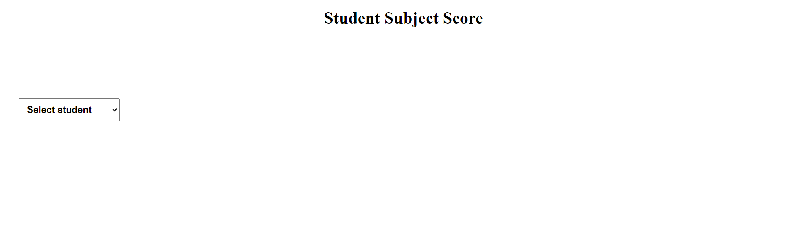

# student-score-dropbox

## Descrption
### This is just a simple dropdown project. In this when you select any student then you will subjects dropdown button after that when you select any subject you will see score of that student in that subject.

## Steps to run application on local server

* Clone repository locally.
* <kbd>npm install</kbd> Run this command in terminal to install all npm packages.
* <kbd>npm run dev</kbd> Run this command in terminal to start react server.
* <kbd>http://localhost:5173/</kbd> Go to browser and search this url in url search bar.

### Tech stack :- 
 HTML | CSS | Javascript | React | vercel

## About project

* ### On main screen you will see a heading and a select box. You have to select student first. As you can see in below image.

* ### After selecting student you will see one more select box for subject of that student. You have to select subject to see score of selected sudent in that subject. As you can see in below image.

* ### After selecting student and subject. You can able to see score selected student in selected subject. As you can see in below image.

* ### If on student's score is displaying on screen and you change to different student subject select box will reset to default. As you can see in below image.

Thank you ❤️
